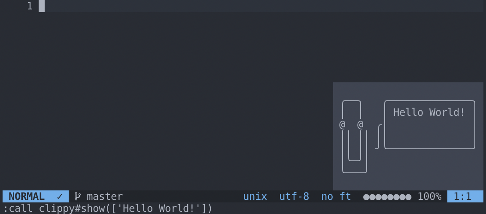

# vim-clippy



## Installation

Install using a plugin manager of your choice, for example [`vim-plug`](https://github.com/junegunn/vim-plug):

```viml
Plug 'josa42/vim-clippy'
```

## Usage

```viml
call clippy#show(['Hello World!'])
```

## License

[MIT © Josa Gesell](LICENSE)
